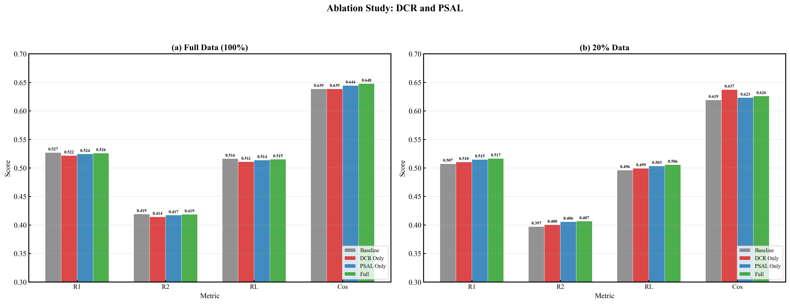
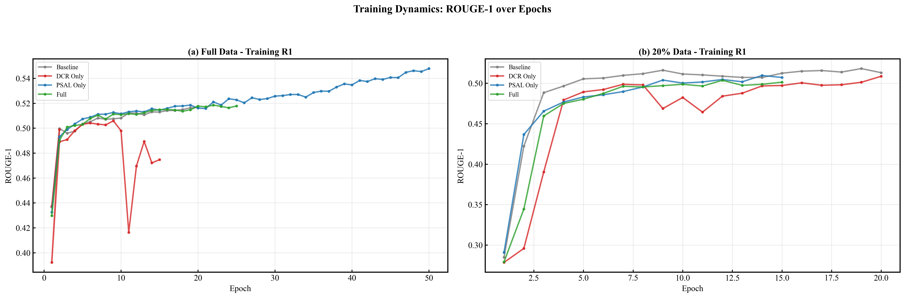
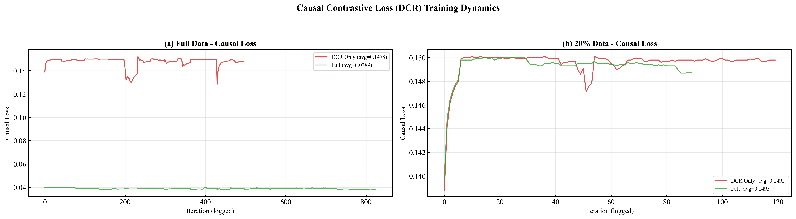
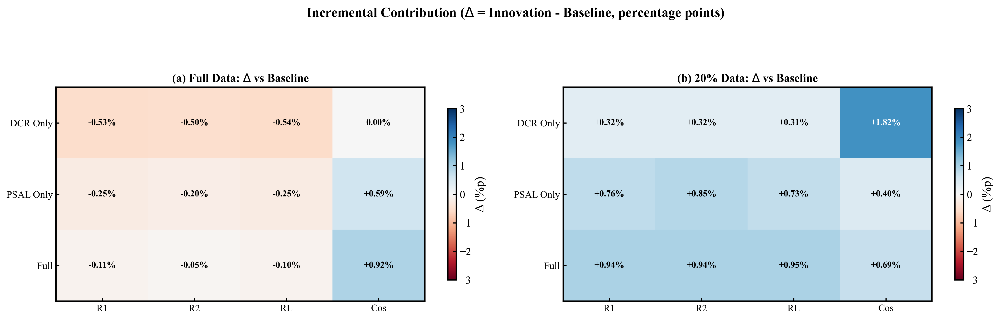

# BLiSS 消融实验统一评估报告

> 生成时间: 2026-03-05 16:40:29

## 全量数据 (100%) — 2×2 消融表

| Model | DCR | PSAL | R1 | R2 | RL | Cos | Causal |
|-------|-----|------|----|----|----|----|--------|
| Baseline | ❌ | ❌ | 0.5270 | 0.4192 | 0.5162 | 0.6386 | 0.0000 |
| DCR Only | ✅ | ❌ | 0.5217 | 0.4142 | 0.5108 | 0.6386 | 0.1482 |
| PSAL Only | ✅ | ✅ | 0.5245 | 0.4172 | 0.5137 | 0.6445 | 0.0000 |
| Full | ✅ | ✅ | 0.5259 | 0.4187 | 0.5152 | 0.6478 | 0.0380 |

## 20% 数据 — 2×2 消融表

| Model | DCR | PSAL | R1 | R2 | RL | Cos | Causal |
|-------|-----|------|----|----|----|----|--------|
| Baseline | ❌ | ❌ | 0.5072 | 0.3972 | 0.4961 | 0.6192 | 0.0000 |
| DCR Only | ✅ | ❌ | 0.5104 | 0.4004 | 0.4992 | 0.6374 | 0.1498 |
| PSAL Only | ❌ | ✅ | 0.5148 | 0.4057 | 0.5034 | 0.6232 | 0.0000 |
| Full | ✅ | ✅ | 0.5166 | 0.4066 | 0.5056 | 0.6261 | 0.1487 |

## Δ 增量贡献分析

### 全量数据

| Innovation | ΔR1 | ΔR2 | ΔRL | ΔCos |
|-----------|-----|-----|-----|------|
| DCR Only | -0.53% | -0.50% | -0.54% | 0.00% |
| PSAL Only | -0.25% | -0.20% | -0.25% | +0.59% |
| Full | -0.11% | -0.05% | -0.10% | +0.92% |

### 20% 数据

| Innovation | ΔR1 | ΔR2 | ΔRL | ΔCos |
|-----------|-----|-----|-----|------|
| DCR Only | +0.32% | +0.32% | +0.31% | +1.82% |
| PSAL Only | +0.76% | +0.85% | +0.73% | +0.40% |
| Full | +0.94% | +0.94% | +0.95% | +0.69% |

## 可视化

## 关键发现

- **全量数据**: 最优模型 = **Baseline** (R1=0.5270, Δ=+0.00%p vs Baseline)
- **20% 数据**: 最优模型 = **Full** (R1=0.5166, Δ=+0.94%p vs Baseline)
- ✅ DCR 修复生效: Causal Loss = 0.1482 (非零)
